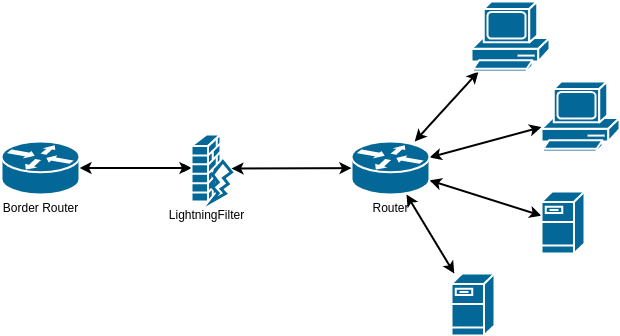
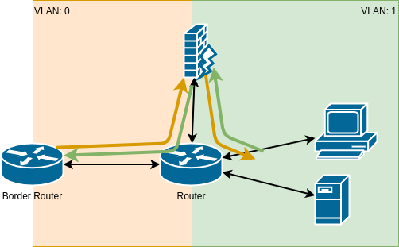
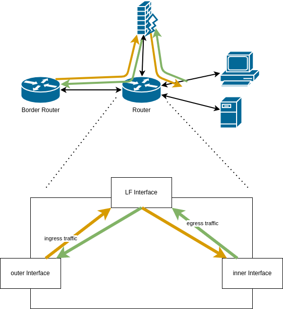

# Deployment (SCION)

LightningFilter, as a stateless Firewall, filters the traffic between a gateway and multiple end-host.
Possible deployments are equivalent or similar to Firewall deployments. The following sections describe some of them.

## 2-Interfaces

Optimally, LightningFilter is positioned between the gateway and the end hosts, e.g., between a border router and a local network router.
One interface connects to the border router, and one interface to the local network router. Hence, there is one outside and one inside-facing interface.
Incoming packets are always expected to come from the border router and are forwarded to the router, and vice versa for outgoing packets.

LightningFilter can operate in two different modes in such a setup: Layer 2 aware or Layer 2 Transparent. The following sections describe the different modes in more detail.

### Layer 2 Aware

The Ethernet address of the border router and the router can be statically configured on LightningFilter. Therefore, use the `inbound` and `outbound` packet modifiers in the configuration.

Also, the border router and the router have to know the ethernet address of the LightningFilter's outer and inner interface, respectively. There are two options to accomplish this.
First, if possible, configure the Ethernet statically on the border router and router.
Second, enable the control traffic worker on LightningFilter and configure the virtual devices on the LightingFilter such that they respond to ARP requests from the border router and router.

#### Future Ideas:
- LightningFilter performs ARP requests over the control traffic interface to obtain the Ethernet address of the border router and router.
- LightningFilter can keep a small table to map IP addresses to Ethernet addresses.

### Layer 2 Transparent

LightingFilter can act transparent on Layer 2 and not modify any addresses when forwarding packets. Local control packets, such as ARP packets, would be forwarded without modifications without checks and changes.

For the layer 2 transparent mode, set all ports into promiscuous mode. The configuration should not contain an `inbound` or an `outbound` packet modifier that changes the Ethernet or IP addresses. Furthermore, the control traffic worker must stay disabled.

## Single Interface

In some scenarios it might not be possible to physically place the LightingFilter appliance between the border router and end-hosts.
This might be the case if the LightningFilter appliance only offers one interface.
The following sections describe some of the deployment possibilities.

> LightningFilter must act layer 2 aware. Otherwise, the switching device connected to the single LightningFilter interface will be confused.

### VLAN Setup
With VLANs, the single interface setup can almost be transformed into a 2-interface deployment.
Therefore, divide the network into two parts; the out-facing network and the in-facing network.
In the out-facing network are the gateway, the VLAN switch, and the LightningFilter. In the in-facing network are all end hosts, the VLAN switch, and the LightningFilter.
The LightningFilter is responsible for passing packets from one VLAN to another. This ensures that all packets reaching the end hosts from the gateway, i.e., the Internet, are checked by LightningFilter.
The LightningFilter is connected to a tagged port, while the border router and the end hosts are connected to untagged ports.

To differentiate incoming from outgoing packets, LightningFilter looks at the provided VLAN tag.

Optimally, the VLAN switching device also has routing capabilities to resolve destination IP addresses to the associated Ethernet address.
LightningFilter just switches source and destination Ethernet addresses when forwarding packets.

### AWS VPC Routing
AWS offers Virtual Private Cloud (VPC) ingress routing ([see here](https://aws.amazon.com/blogs/aws/new-vpc-ingress-routing-simplifying-integration-of-third-party-appliances/)) to redirect all incoming and outgoing traffic through certain virtual appliances on which LightningFilter would run.
In summary, two configurations have to be made:
1. On the gateway, route all ingress traffic (meant for the end-hosts) to the LightningFilter appliance.
1. On the end hosts, route all outgoing traffic to the LightingFilter appliance instead of the gateway.

The LightningFilter differentiates incoming and outgoing LF packets based on ??.
LightningFilter switches the Ethernet source and destination address when forwarding packets.

Similar deployment can be achieved in other cloud providers or network setups, assuming the routing device offers such functionality.

### Via LightningFilter

In case no routing-capable device is located between the LightingFilter and the end hosts, the deployment possibilities are limited.
If only one end host device exists, the LightningFilter can act as the gateway for the end host device.

Incoming and outgoing traffic is differentiated by checking if the destination host address corresponds to the end host address.
Packet modifiers must be configured, so incoming traffic is forwarded to the end host and outgoing traffic is forwarded to the border router.