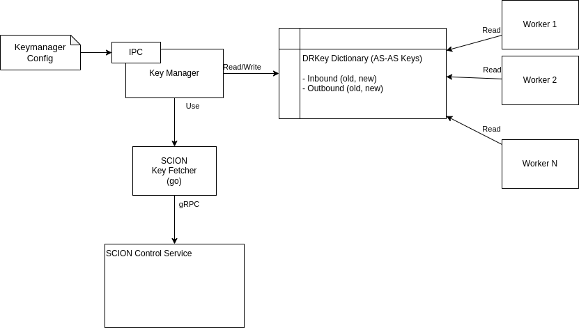
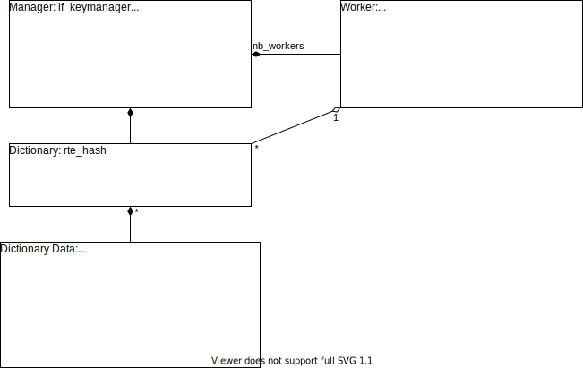

# Keymanager

## Data Structures

For key management, there exists one global dictionary, which contains all relevant keys.
Workers do not have separate structures because they only read keys and the dictionary is not expected to change often.
As dictionary, the rte_hash structure is used, which is a cuckoo hash table with a lock-free RW implementation.

Each dictionary entry consists of three key containers: inbound_key, old_inbound_key, outbound_key, old_outbound_key.
A key container is a structure, which contains a key and its validity period.

### Accessing Key
Workers request keys from the AS dictionary.
If the dictionary contains an entry for the requested key, the worker verifies the validity of the received key with its current timestamp.
If the key is valid, the worker uses it.

During the transition period of keys, the worker may use the old key if available and valid with respect to the grace period.

### Update Single Key
Since AS keys are only valid for certain amount of time, they have to be updated regularly.
This is achieved by creating a new dictionary data structure and replacing the old one.

Transition to a new outbound key is performed as soon as the key becomes outdated,
i.e., outbound_key->validity_not_after <= current_time + LF_DRKEY_PREFETCHING_PERIOD.

Transition to a new inbound key is performed slightly before the key becomes outdated,
i.e., inbound_key->validity_not_after <= current_time + LF_DRKEY_PREFETCHING_PERIOD.

When updating a key, the replaced key is kept in the dictionary because it is likely to be still valid.

After updating an outbound key, the old key is usually used for LF_DRKEY_PREFETCHING_PERIOD seconds.
After updating an inbound key, the old key potentially has to be used for LF_DRKEY_PREFETCHING_PERIOD + LF_DRKEY_GRACE_PERIOD + LF_TIME_THRESHOLD.
Because at most two keys are stored in the dictionary, the DRKey validity period must be at least LF_DRKEY_PREFETCHING_PERIOD + LF_DRKEY_GRACE_PERIOD + LF_TIME_THRESHOLD.
Otherwise, it is possible that a valid DRKey is removed too early.

### Update AS List
When the a new configuration is loaded, the dictionary is updated.
First, entries which are not anymore in the configuration are removed from the dictionary.
Secondly, new entries are added to the dictionary.
After all workers have passes through the quiescent state, the removed entries are freed.

### Thread Synchronization
Updates to the DRKey manager are synchronized with a management lock.
The hash table provides a lock free RW implementation (RTE_HASH_EXTRA_FLAGS_RW_CONCURRENCY_LF), such that concurrent writes and reads are possible.
Freeing of old data are synchronized through the worker's RCU mechanism.