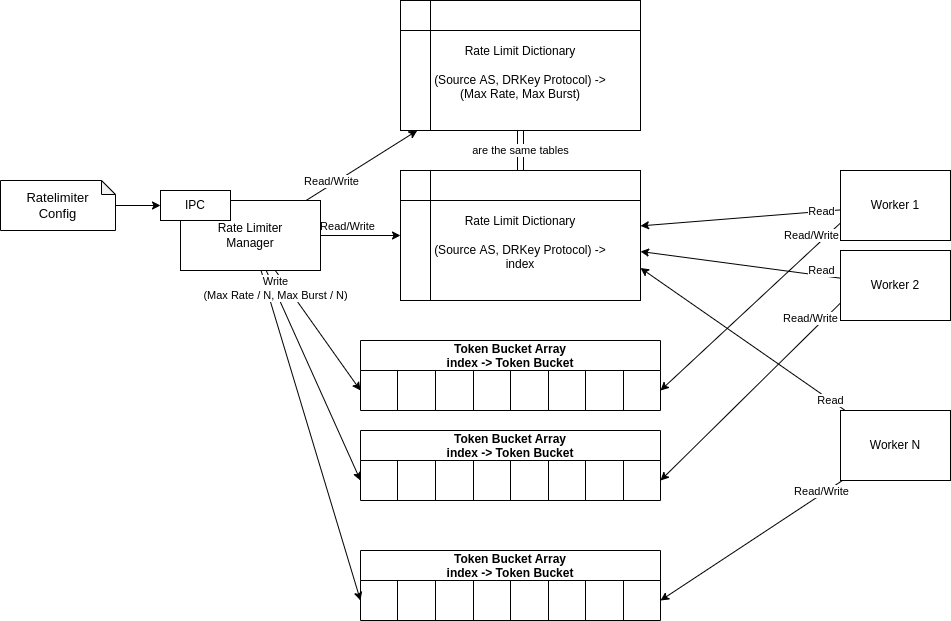
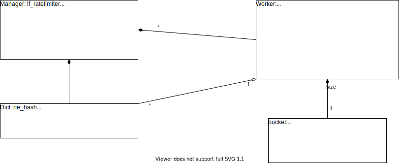

# Rate Limiter

## Data Structure
For rate-limiting, one global hash table (rte_hash) is used by the ratelimiter service and the workers.
Rate limit information, such as refill rate, is directly stored in the hash table and only accessed by the ratelimiter service (not workers).

Each worker has its token buckets, all stored in an array.
To access a specific token bucket, the workers perform a look up at the hash table to obtain the index.
Each worker also has a best-effort bucket.

This data structure ensures that the token buckets are usually accessed by one thread at a time.
Only when the rate or burst is updated, the ratelimiter module accesses the workers' token buckets (but with relaxed memory order).
To avoid false sharing between cores, token bucket arrays are cache line aligned.

### Update Rate

When performing a rate update, the manager first sets the new rate and burst size in the global rate limit table and then in the worker's token buckets.
The update to a worker's token bucket is performed atomically with relaxed memory order. At last, the manager waits for all workers to pass through the quiescent state ensuring that all updates are transmitted to the workers.

### Update AS List

The hash table provides a lock-free RW implementation, allowing entries to be updated, removed, and added while workers access it.

First, entries that are in the hash table but not in the configuration are removed.
Then, the manager waits for all workers to pass through the quiescent state.
Afterward, entries are added or just updated.

Passing through the quiescent state between removing and adding entries is necessary. Otherwise, the worker might apply wrong rate limits.
When removing AS A from the hash table and add AS B, the worker's token bucket might not have update due to the relaxed memory order. Hence, a worker looking up AS B in the dictionary would receive the key_id, which points to the token bucket corresponding to AS A.

> Note that the token count of a worker's bucket is never reset by the manager (even if an AS replaces another AS in the hash table as described above).
Because of that it is possible that for a newly added AS starts with an non-zero token count.
This has been considered acceptable since the worker always checked that the token count never exceed the currently set burst size when applying the rate limits.
However, this behavior might be adjusted in the future as starting with a full token bucket can seem unintuitive.

Note that the hash table and the bucket arrays have a fixed size, which is determined at the startup. Hence, if the new AS list is bigger, the update will not succeed.
