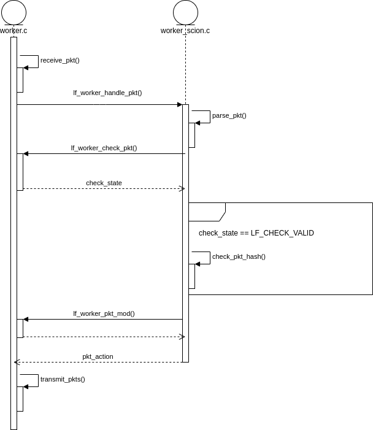

# Worker

The worker implements the LightningFilter pipeline and processes packets (inbound and outbound).
The implementation is divided into protocol-independent and protocol-dependent parts (with protocol meaning SCION vs IP vs custom).
The protocol-independent part (defined in `worker.c`) contains the receiving and transmitting logic, almost all of the LightingFilter check pipeline for inbound packets, and some small utility functions.
The protocol-depend part (defined in `worker_scion.c` or `worker_ip.c`) contains packet parsing, packet hash computation for inbound packets, and the complete logic for outbound packets.

The following diagram, which depicts the sequence of function calls performed after receiving an inbound packet with an LF SPAO header, provides an overview of the dependencies between the `worker.c` and `worker_scion.c`.

As the diagram depicts, between receiving and transmitting packets, in the function `lf_worker_handle_pkt()`, `worker_scion.c` is responsible for parsing the packet and performing all required function calls.

## Some Thoughts on the modular approach
By dividing the worker's implementation, we try to achieve modularity.
The modular approach provides a consistent code base for LightningFilter implementations fitted for a specific environment, such as SCION or IP.
Furthermore, even more importantly, this allows for small custom worker implementations.
E.g., for a WireGuard protection setup, the packet hash only has to contain the WireGuard header because WireGuard already authenticates the rest of the payload.
