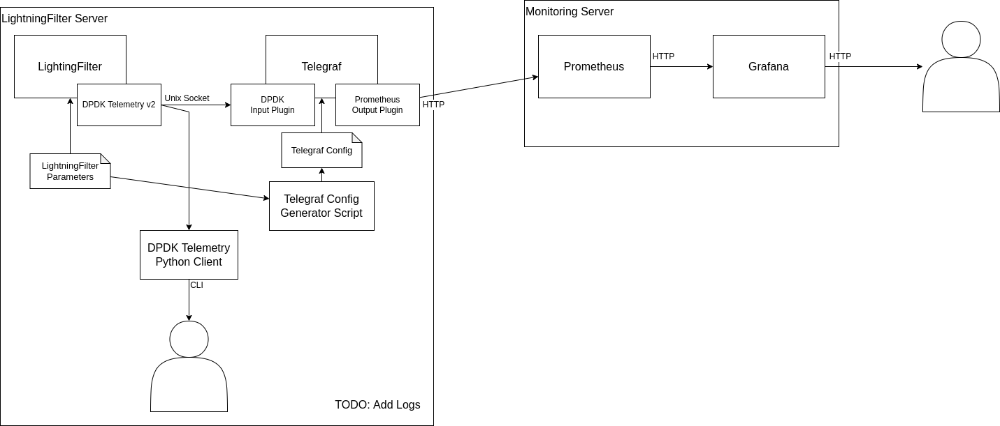

# Monitoring System

In the following, a simple monitoring setup is presented, which can serve as a starting point for more complex systems.
The setup consists of Telegraf for data collection, Prometheus for data aggregation, and Grafana for data presentation.



Telegraf provides an input DPDK plugin to communicate with the DPDK telemetry socket, which is also used by LightningFilter to expose its metrics. Futhermore, Telegraf is able to collect data about memory consumption and CPU utilization. In regular intervals, Prometheus requests the collected data from Telegraf and aggregates them in its database. Grafana pulls the data from Prometheus and presents them in dashboards.

Configuration files for Telegraf and Prometheus can be found here ([telegraf.conf](telegraf.conf), [prometheus.yml](prometheus.yml)). These configurations are sufficient to run Telegraf and Prometheus in our simple example setup. For Grafana, first the Prometheus server has to be added as data source. The JSON file [grafana/db_Rates.json](grafana/db_Rates.json) provides a simple dashboard showing traffic rate of LightningFilter.

The services are started as follows:
```
sudo telegraf --config telegraf.conf
```

```
prometheus --config.file=prometheus.yml
```

```
sudo systemctl start grafana-server
```

The Grafana web server is reachable on port `3000`. Per default, use username `admin` with password `admin` to log in.

## Setup Details

### Ports

Telegraf (Prometheus Client): 9273
Prometheus (HTTP): 9090
Grafana (HTTP): 3000

## Installation
In the following, we provide simple installation instructions for Grafana, Prometheus, and Telegraf. The instructions only serve as a reference and are suited for test setups. Please adjust them when deploying a production setup.

### Grafana

Installation:
```
wget -q -O - https://packages.grafana.com/gpg.key | sudo apt-key add -
sudo add-apt-repository "deb https://packages.grafana.com/oss/deb stable main"
sudo apt update && sudo apt install grafana
```

Start Application:
```
sudo systemctl daemon-reload
sudo systemctl start grafana-server
sudo systemctl status grafana-server
```

### Prometheus
Version: 2.37 (LTS)
https://prometheus.io/docs/prometheus/2.37/getting_started/

Installation
```
# configuration directory:
# data directory:
sudo mkdir -p /var/lib/prometheus

wget https://github.com/prometheus/prometheus/releases/download/v2.37.1/prometheus-2.37.1.linux-amd64.tar.gz 
tar xvfz prometheus-*.tar.gz
cd prometheus-2.37.1.linux-amd64

sudo mv prometheus promtool /usr/local/bin/
prometheus --version
```

Start Application:
```
prometheus --config.file=prometheus.yml
```

The prometheus metrics can be browsed on port `9090`.

### Telegraf
Installation:
```
wget -q https://repos.influxdata.com/influxdb.key
echo '23a1c8836f0afc5ed24e0486339d7cc8f6790b83886c4c96995b88a061c5bb5d influxdb.key' | sha256sum -c && cat influxdb.key | gpg --dearmor | sudo tee /etc/apt/trusted.gpg.d/influxdb.gpg > /dev/null
echo 'deb [signed-by=/etc/apt/trusted.gpg.d/influxdb.gpg] https://repos.influxdata.com/debian stable main' | sudo tee /etc/apt/sources.list.d/influxdata.list
sudo apt-get update && sudo apt-get install telegraf
```

Start Application:
```
sudo telegraf --config telegraf.conf
```
(Require root to access DPDK telemetry)

#### Plugin: Input DPDK
https://github.com/influxdata/telegraf/blob/release-1.22/plugins/inputs/dpdk/README.md

### Alternative Data Collection: collectd

Alternatively to Telegraf, also collectd provides a DPDK plugin to access data provided through a telemetry socket.
This setup has not been tested and the instructions only server as reference.

Installation:
```
git clone https://github.com/collectd/collectd
cd collectd
git checkout collectd-5.12.0
./build.sh
./configure --enable-dpdk_telemetry

```
Adjust installation path by specifying the `--prefix` configuration option.

General Dependencies:
```
sudo apt-get install build-essential autoconf automake flex bison libtool pkg-config
```

DPDK telemetry collector plugin dependencies:
```
wget https://github.com/akheron/jansson/releases/download/v2.14/jansson-2.14.tar.bz2
bunzip2 -c jansson-2.14.tar.bz2 | tar xf -
cd jansson-2.14
./configure
make
sudo make install
```
Adjust installation path by specifying the `--prefix` configuration option.

### Configuration Generation
The Telegraf config must be adjusted for a specific number of LightningFilter workers and if the LightningFilter uses a custom DPDK file-prefix.
With the provided script `gen_telegraf_conf.sh`, a Telegraf config with an arbitrary number of workers and custom file-prefix can be generated.
The script expects the arguments as follows:
```
./gen_telegraf_conf.sh <nb_workers> <file_prefix>
```